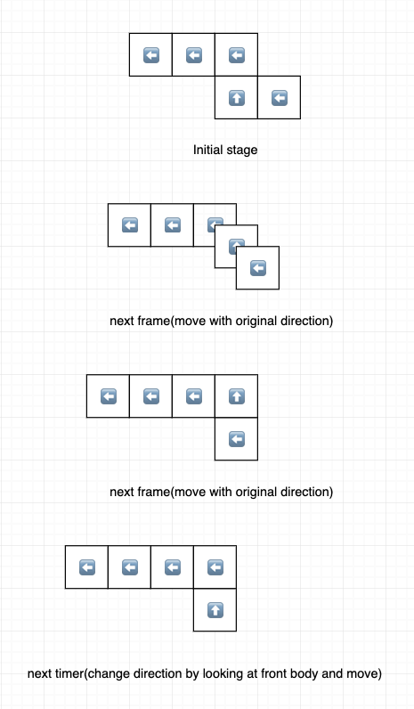
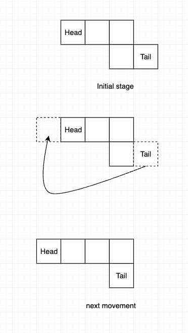

# gluttonous-snake

Rust language version of Gluttonous Snake. Developed by bevy engine.

New to rust and bevy, and try hard to be used to `ECS` :)

## Implementations

### [Main Branch](https://github.com/sasakiyori/gluttonous-snake/tree/main)

Snake stores as pieces, every piece owns a `Direction` enum which will control its translation.

```rust
#[derive(Component)]
pub struct Snake(pub Direction);
```

Since the later spawned sprite has bigger entity id (I am not sure for this but at least it is true in practice), we can treat the `Query<Snake>` is an ordered snake body.  

All snake pieces will move with their own direction in every frame, but only when timer ticked, they will change their direction first and then move. Attention, the speed of every frame, the timer duration and snake size should be a divisible relationship, or else the movement of whole snake will break down.

```rust
// n should be a positive integer
let snake_size = speed * timer_duration * n;

// currently: snake_size = 18.0px, speed = 3.0px, timer_duration = 0.1s, frame = 1/60 s
```

The rule for direction change is:  

- header change the direction by keyboard input
- other pieces use the direction of their front piece



### [Move By Carry Pieces Branch](https://github.com/sasakiyori/gluttonous-snake/tree/move_by_carry_pieces)

Snake stores as pieces, but there is a struct to manage all pieces and the main direction of snake.

```rust
#[derive(Component)]
pub struct SnakePiece;

#[derive(Component)]
pub struct Snake {
    pub body: LinkedList<Entity>,
    pub direction: Direction,
}
```

The idea of this branch is, when snake totally move a length of snake piece size, we can treat it as move the snake tail piece to the snake head.  


The advantage for this idea is that we don't need to control movements in every frame. And obviously the disadvantage is the movement of snake looks not so smoothly, and if we want to improve it, we have to speed snake up so that we can flush the pieces quickly.

## TODO

This repo still have many works to do and bugs to fix.

- [ ] If we change directions when snake eat bean, it may cause the separation of snake body(Main Branch).
- [ ] Beans and snake should spawned inside window.
- [ ] Beans and snake should spawned with grid alignment.
- [x] The order of dead check and eat check.
- [ ] Game Menu.
- [ ] Score Display.
- [ ] Audio.
- [ ] Better sprite texture.
